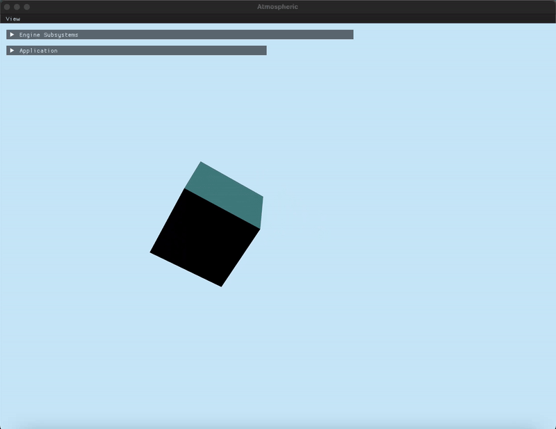

# Atmospheric Engine
**Atmospheric Engine** is a cross-platform 3D game engine developed in C++.
The project is a labor of love, acting as my stepping stone to gain a deeper understanding of graphics programming concepts and practices.

### Features
- PBR texturing, point/directional shadows, post-processing effects
- Heightmap terrain with collision and shader-based dynamic tessellation
- Custom key binding system
- Immediate-mode debug UIs for engine subsystems
- Simple job system implementation

### Platforms
- Apple Silicon
- Apple Intel (unsure?)
- Windows (broken)
- Linux (planned)

⚠️ WARNING
This project is a work in progress and may be unstable at this stage.

----

## Building
Follow the steps below to build the engine:
1. Install prerequsites:
- [CMake](https://cmake.org/download/) (required)
- [EMSDK](https://emscripten.org/docs/getting_started/downloads.html) (optional)
2. Clone this repository
```
git clone --recurse-submodules https://github.com/painfulexistence/AtmosphericEngine.git
```
3. Setup Vcpkg
```
cd AtmosphericEngine
./vcpkg/bootstrap-vcpkg.sh -disableMetrics
```
4. Build the project with CMake
```
cmake -S . -B build
cmake --build build
```

----

## Usage
The engine includes four example projects to help you get started. Please note that the API is still evolving and may change in the future. To get started, you can check out the HelloWorld example.



Examples:
- [Hello World](https://github.com/painfulexistence/AtmosphericEngine/tree/main/Example_HelloWorld)
- [Terrain (dynamic-tessellated)](https://github.com/painfulexistence/AtmosphericEngine/tree/main/Example_Terrain)
- [Maze FPS](https://github.com/painfulexistence/AtmosphericEngine/tree/main/Example_MazeWorld)
- [Breakout 2D (WIP)](https://github.com/painfulexistence/AtmosphericEngine/tree/main/Example_Breakout2D)
